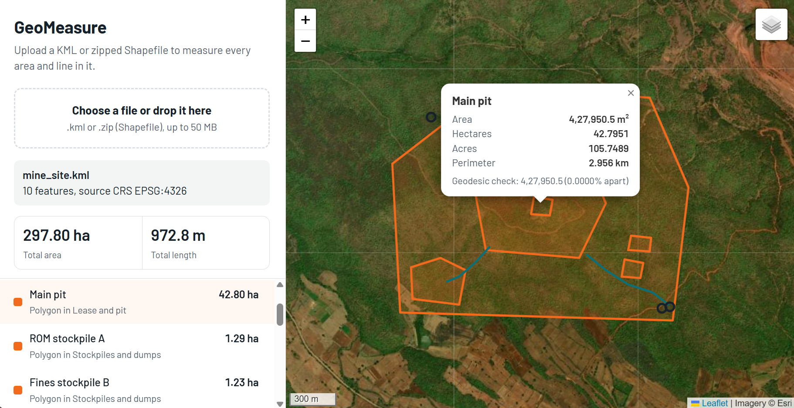
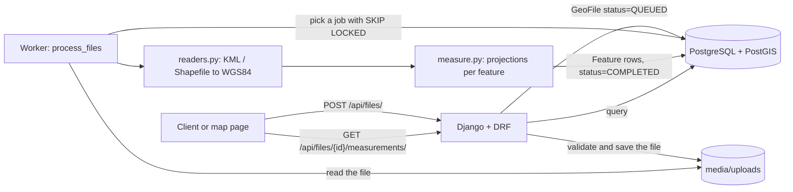

# GeoMeasure API

[](https://github.com/Aawaizp/geomeasure-api/actions/workflows/ci.yml)

GeoMeasure is a Django REST API that takes a KML file or a zipped Shapefile, reads every
feature in it, and tells you the area of each polygon and the length of each line.

I built this for the Aereo Software Development Intern assignment. Files are processed by a
background worker, results are saved in PostgreSQL with PostGIS, and there is a small map
page where you can upload a file and see the measurements on a map.



---

## Contents

1. [Why I built it this way](#why-i-built-it-this-way)
2. [Running it locally](#running-it-locally)
3. [Sample files](#sample-files)
4. [API](#api)
5. [How the measurement works](#how-the-measurement-works)
6. [CRS handling](#crs-handling)
7. [Architecture](#architecture)
8. [Design decisions](#design-decisions)
9. [Tests](#tests)
10. [Learnings](#learnings)
11. [How AI was used](#how-ai-was-used)
12. [Future scope](#future-scope)

---

## Why I built it this way

I tried to build this like something a real survey team would use, not only something that
passes the requirements. While building, I kept asking who would open it and what they would
need.

- A surveyor or site engineer just wants to drop a file and see the result. So I added a map
  page: upload a file, see every feature on a street or satellite map, and click one to see
  its numbers.
- A mine manager or land-records officer usually thinks in hectares or acres. So every area
  is returned in square metres, hectares and acres, with totals for the whole file.
- People need to trust the numbers. So every measurement says which method was used and
  includes a second, independent calculation (geodesic) to compare against. If something
  had to be assumed, like a missing `.prj` file, the result says so.
- Bad input should never crash anything. Wrong uploads get a clear error, one broken
  feature does not fail the whole file, and a failed file tells you why it failed.
- Big files should not make the user wait on the upload. The upload returns straight away
  and a background worker does the processing.

I also kept some things out on purpose (login, volume calculations, more file formats). They
are listed in [Future scope](#future-scope). I wanted the core to be correct and well tested
first.

---

## Running it locally

You only need [Docker Desktop](https://www.docker.com/products/docker-desktop/). Python, GDAL
and PostGIS all run inside containers, so nothing else has to be installed.

```bash
git clone https://github.com/Aawaizp/geomeasure-api.git
cd geomeasure-api
cp .env.example .env          # on Windows PowerShell: Copy-Item .env.example .env
docker compose up --build
```

This starts three containers:

| Container | What it does |
|---|---|
| `db` | PostgreSQL 16 with PostGIS 3.4 |
| `web` | The Django API and the map page, on http://localhost:8000 |
| `worker` | Processes uploaded files in the background |

Open http://localhost:8000 and upload one of the sample files below.

To run the tests:

```bash
docker compose exec web python manage.py test
```

---

## Sample files

All three samples are made-up sites, but they are built to look like the data a drone survey
company actually deals with.

| File | Format | What is in it |
|---|---|---|
| `samples/mine_site.kml` | KML with 4 folders | An open-cast iron ore mine in the Ballari mining belt. It has a lease boundary, a pit with an unmined island in the middle (a polygon with a hole), ore stockpiles, a waste dump, two haul roads with width and surface attributes, and ground control points with altitude. |
| `samples/village_parcels_utm43n.zip` | Shapefile in UTM zone 43N | Five land parcels in a village near Tumakuru, similar to SVAMITVA survey data. The coordinates are in metres, not degrees, so it checks that reprojection works. |
| `samples/bengaluru_site.kml` | KML | The simplest case: one polygon, one line and one point. I use it in the API examples below. |

---

## API

| Method | Endpoint | What it does |
|---|---|---|
| `POST` | `/api/files/` | Upload a `.kml` or a `.zip` with a Shapefile. Returns `202` and the file is queued. |
| `GET` | `/api/files/` | List uploaded files, newest first. |
| `GET` | `/api/files/{id}/` | File details and processing status. |
| `GET` | `/api/files/{id}/measurements/` | Measurements for every feature, plus a summary. |
| `GET` | `/api/health/` | Checks that the API and PostGIS are running. |

### Upload a file

```bash
curl -F "file=@samples/bengaluru_site.kml" http://localhost:8000/api/files/
```

Response `202 Accepted`:

```json
{
  "id": "2cc4153e-7f79-4aee-8f71-d772bfc48aba",
  "filename": "bengaluru_site.kml",
  "file_type": "KML",
  "size_bytes": 851,
  "sha256": "14f48044dad8197de41574534427735ccb1ccba5ae82b5e5fffa2c85a3f587f1",
  "status": "QUEUED",
  "crs": "",
  "feature_count": null,
  "error_message": "",
  "warnings": [],
  "created_at": "2026-10-07T08:11:08.770266Z",
  "started_at": null,
  "completed_at": null
}
```

If the upload is wrong, you get a `400` with the reason:

```json
{"file": ["Unsupported file extension '.md'. Allowed: .kml, .zip."]}
```

### Check the status

```bash
curl http://localhost:8000/api/files/2cc4153e-7f79-4aee-8f71-d772bfc48aba/
```

```json
{
  "id": "2cc4153e-7f79-4aee-8f71-d772bfc48aba",
  "filename": "bengaluru_site.kml",
  "status": "COMPLETED",
  "crs": "EPSG:4326",
  "feature_count": 3
}
```

(Some fields are left out here to keep it short.) The status goes from `QUEUED` to
`PROCESSING` to `COMPLETED`, or to `FAILED` with an `error_message`.

### Get the measurements

```bash
curl "http://localhost:8000/api/files/2cc4153e-7f79-4aee-8f71-d772bfc48aba/measurements/?geometry=false"
```

```json
{
  "id": "2cc4153e-7f79-4aee-8f71-d772bfc48aba",
  "filename": "bengaluru_site.kml",
  "status": "COMPLETED",
  "source_crs": "EPSG:4326",
  "warnings": [],
  "summary": {
    "feature_count": 3,
    "by_geometry_type": {
      "LineString": {"count": 1, "total_length_m": 630.955},
      "Point": {"count": 1},
      "Polygon": {"count": 1, "total_area_m2": 300075.4}
    },
    "by_measurement_status": {"MEASURED": 2, "NOT_APPLICABLE": 1},
    "total_area_m2": 300075.4,
    "total_area_hectares": 30.00754,
    "total_length_m": 630.955
  },
  "features": [
    {
      "index": 0,
      "layer": "Bengaluru survey site",
      "geometry_type": "Polygon",
      "crs": "EPSG:4326",
      "properties": {"Name": "Site boundary"},
      "measurement_status": "MEASURED",
      "measurements": {
        "area_m2": 300075.4,
        "area_hectares": 30.00754,
        "area_acres": 74.150246,
        "perimeter_m": 2191.269,
        "method": "Local equal-area (LAEA) centred on 12.97250, 77.59250",
        "cross_check": {"geodesic_value": 300075.4, "difference_percent": 0.0}
      },
      "notes": ""
    },
    {
      "index": 1,
      "geometry_type": "LineString",
      "properties": {"Name": "Access road"},
      "measurement_status": "MEASURED",
      "measurements": {
        "length_m": 630.955,
        "length_km": 0.630955,
        "method": "Local Transverse Mercator centred on 12.97057, 77.59038",
        "cross_check": {"geodesic_value": 630.955, "difference_percent": 0.0}
      }
    },
    {
      "index": 2,
      "geometry_type": "Point",
      "properties": {"Name": "Main gate"},
      "measurement_status": "NOT_APPLICABLE",
      "measurements": null
    }
  ]
}
```

Query parameters:

- `geometry=false` leaves out the geometries, which makes the response much smaller.
- `status=MEASURED` (or `NOT_APPLICABLE`, `UNSUPPORTED`, `ERROR`) returns only those features.

Response codes:

| Code | Meaning |
|---|---|
| `200` | The file is processed and the measurements are returned. |
| `202` | The file is still queued or processing. Try again in a moment. |
| `404` | There is no file with that id. |
| `422` | The file could not be processed. `detail` says why. |

What each `measurement_status` means:

| Status | When |
|---|---|
| `MEASURED` | Polygon or MultiPolygon (area and perimeter), LineString or MultiLineString (length). |
| `NOT_APPLICABLE` | Point or MultiPoint. Nothing to measure. |
| `UNSUPPORTED` | Other types like GeometryCollection. They are reported, not crashed on. |
| `ERROR` | The feature has no geometry, or a broken polygon is empty after repair. `notes` explains. |

---

## How the measurement works

The brief says not to measure in latitude and longitude degrees, and to project the geometry
first. The real question is which projection to use, because every projection distorts
something.

To see how much it matters, I measured the Bengaluru sample site in different ways and
compared each one with the exact value on the WGS84 ellipsoid (geodesic):

| Method | Site area | Error | Road length | Error |
|---|---:|---:|---:|---:|
| Raw degrees | 0.000025 "deg²" | not usable | - | - |
| Web Mercator (EPSG:3857) | 317,914.6 m² | +5.9 % | 648.99 m | +2.9 % |
| UTM zone 43N (EPSG:32643) | 300,422.8 m² | +0.12 % | 631.32 m | +0.06 % |
| UTM zone 44N (the next zone) | 300,851.1 m² | +0.26 % | 631.77 m | +0.13 % |
| Global equal-area (EPSG:6933) | 300,075.4 m² | 0.00 % | 623.18 m | -1.2 % |
| This API | 300,075.4 m² | 0.00 % | 630.955 m | 0.00 % |
| Geodesic (reference) | 300,075.4 m² | - | 630.955 m | - |

Two things stood out to me:

1. No single projection is good for both area and length. The equal-area projection gets the
   area exactly right but the road length is 1.2 % wrong.
2. UTM is good but not exact. A UTM zone is 6° wide, and its scale changes across the zone,
   so lengths can be off by up to about 0.1 %.

So each feature is measured in projections centred on that feature:

| What | Projection | Why |
|---|---|---|
| Area | Lambert Azimuthal Equal-Area, centred on the feature | It keeps area correct by design, and centring it on the feature keeps the shape distortion tiny. |
| Length and perimeter | Transverse Mercator, centred on the feature (scale factor 1) | Same family as UTM, but with no scale error at the centre of the feature. |
| Cross-check | Geodesic calculation on the WGS84 ellipsoid (`pyproj.Geod`) | It doesn't use any projection, so it's a fair independent check. If the two differ by more than 0.5 %, a note is added. |

A few other things the code takes care of (in `geofiles/geo/measure.py`):

- **Holes in polygons** are subtracted, even when a file draws the hole in the same direction
  as the outer ring.
- **Invalid polygons**, like a self-crossing "bow-tie" shape, are repaired with
  `shapely.make_valid` and a note is added. Without this, a bow-tie can measure as 0.
- **Altitude** in KML coordinates is dropped, so lengths are flat map distances.
- **Multi-part geometries** are measured as one feature, with the parts added together.

I tested the accuracy with squares of a known size (for example exactly 1 km × 1 km) at
three places: Bengaluru, Oslo (60° N) and Sydney.

---

## CRS handling

When a file is read, every feature is converted to WGS84 (EPSG:4326). After that each feature
is projected as explained above. Because of this, any input CRS goes through the same steps.

| Input | What happens |
|---|---|
| KML | Always WGS84 longitude and latitude (the KML standard requires this). |
| Shapefile with a `.prj` in a geographic CRS | Converted to WGS84. |
| Shapefile with a `.prj` in a projected CRS (UTM, a CRS in feet, and so on) | Converted to WGS84 with pyproj, so the units are handled correctly. The area is then measured on the ground, not in grid units. |
| Shapefile with no `.prj`, and coordinates inside ±180 / ±90 | EPSG:4326 is assumed and a warning is returned with the result. |
| Shapefile with no `.prj`, and coordinates outside that range | Rejected with a clear message, because guessing would give wrong numbers. |

The original CRS of the file is returned as `crs` or `source_crs` (for example `EPSG:32643`).

Here is an example of why this matters. In the village sample, parcel KA-TMK-0101 is
768.37 m² if you calculate directly from its UTM coordinates, but the real area on the
ground is 768.0 m². UTM grid units are not exactly metres on the ground, and the difference
depends on how far the parcel is from the centre of the zone. There is a test for this case.

---

## Architecture



### Folder structure

```
config/                 Django settings, main URLs, health check
geofiles/
  models.py             GeoFile (the upload and its job status) and Feature (geometry and measurements)
  validators.py         Upload checks: extension, size, real file content, SHA-256
  serializers.py        API output, unit conversions, cross-check values
  views.py              Upload, detail, measurements and the map page
  services.py           Picking jobs and processing them (the only place that saves results)
  geo/
    readers.py          Safe zip extraction, reading KML and Shapefiles, converting to WGS84
    measure.py          The measurement functions. No Django here, just Shapely and pyproj
  management/commands/
    process_files.py    The background worker
  templates/geofiles/
    viewer.html         The Leaflet map page
  tests/                44 tests
samples/                Sample files (mine site, village parcels, simple site)
```

The code only depends in one direction: `views` uses `services`, and `services` uses `geo`.
`measure.py` doesn't know anything about Django, files or the database, so the most important
part of the project is easy to read and test on its own.

### What happens when a file is uploaded

1. `POST /api/files/` checks the extension and the size, and checks that the content really
   is a ZIP or XML file (not just a renamed file). It saves the file, stores its SHA-256 hash
   and returns `202` with the status `QUEUED`.
2. The worker picks the oldest queued file inside a database transaction using
   `SELECT ... FOR UPDATE SKIP LOCKED` and sets it to `PROCESSING`. Because of `SKIP LOCKED`,
   two workers never pick the same file.
3. `readers.py` reads the file.
   - For KML, every folder is read, not just the first one.
   - For a ZIP, it first checks for unsafe paths (`../`), symlinks, encryption, too many
     files and zip bombs (huge size or compression ratio). Then it extracts to a temporary
     folder, finds every `.shp` file at any depth and checks that its `.shx` and `.dbf` are
     there.
4. Every feature is converted to WGS84, made 2D and given a clean `properties` dictionary.
5. `measure.py` measures each feature. If one feature has a problem, only that feature gets
   an `ERROR` status. The rest of the file is still processed.
6. All the features and the final status are saved in one transaction, so a file is never
   saved half done. Any problem ends in `FAILED` with a readable message.

---

## Design decisions

| Decision | Other options I considered | Why I chose this |
|---|---|---|
| Django + DRF + GeoDjango | FastAPI | Django gives a solid ORM, migrations and an admin panel, and GeoDjango adds PostGIS geometry fields. Aereo's own job posts also mention Django. |
| PostgreSQL + PostGIS | SQLite, or storing geometry as JSON | Real geometry columns can be indexed and used for spatial queries later, like finding features inside a boundary. |
| Background worker using the database as a queue | Processing during the request, or Celery + Redis | Processing during the request would make big uploads slow. A database queue with `SKIP LOCKED` needs no extra services and works with several workers. Celery would be the next step for much higher volume. |
| A projection centred on each feature | One UTM zone for the whole file, `estimate_utm_crs()`, or geodesic only | One zone for the whole file is wrong when the features are far apart, and UTM has up to about 0.1 % scale error. The brief asks for a projected CRS, so I use geodesic values as a check, not as the main result. |
| Store geometry in EPSG:4326 | Store it in the file's own CRS | One common CRS makes geometries from different files comparable and easy to index. The original CRS is still saved on the file. |
| Return `202 Accepted` on upload | `201 Created` with the results | Processing happens later, so `202` is the honest answer: the file is accepted but not done yet. |
| Fail clearly instead of guessing | Silently assume a CRS | A missing `.prj` with projected coordinates would give numbers that look fine but are wrong. |

---

## Tests

```bash
docker compose exec web python manage.py test
```

| Test file | What it covers |
|---|---|
| `test_measure.py` | Shapes of known size at three latitudes, holes, multipolygons, bow-tie repair, line length, altitude, unsupported types |
| `test_readers.py` | All KML folders read, a projected Shapefile measured on the ground, Shapefiles in sub-folders, Mac metadata files, missing `.shx` or `.prj`, path traversal, zip bombs |
| `test_samples.py` | The sample files: all mine-site folders, the pit hole, KML attributes, UTM parcels measured on the ground |
| `test_upload_api.py` | Accepted and rejected uploads (wrong extension, fake content, empty, too large) and the detail endpoint |
| `test_processing.py` | Upload, worker and measurements end to end, failed files, and a job being picked only once |
| `test_viewer.py` | The map page loads |

GitHub Actions runs all 44 tests against a real PostGIS database on every push. It also
fails if a model change is missing its migration.

---

## Learnings

- **Thinking like a product builder changed my decisions.** The brief only needed three
  endpoints, but I kept asking how a surveyor or a mine manager would actually use this.
  That's why I added the map page, hectares and acres, the cross-check and clear error
  messages. Honestly, this was the part I enjoyed the most.
- **Measuring area is not as simple as it looks.** I thought you just calculate the area from
  the coordinates. Then I saw that Web Mercator gave almost 6 % more area for a site in
  Bengaluru, and even UTM was off by about 0.1 %.
- **One projection can't do everything.** The equal-area projection gave a perfect area but
  the road length was 1.2 % wrong, so I used one projection for area and another for length.
- **Ring direction matters.** If a hole is drawn in the same direction as the outer ring, the
  geodesic area can add the hole instead of subtracting it. I only understood this properly
  after writing a test for it.
- **Real files are messy.** KML folders are read as separate layers, so reading only the
  first one loses data without any error. Zips made on a Mac contain `__MACOSX` files, and
  some Shapefiles don't have a `.prj` file.
- **Uploading a ZIP is a security risk.** I learned about zip-slip (`../../` paths) and zip
  bombs, and added checks before extracting anything.
- **A database can work as a job queue.** With `SELECT ... FOR UPDATE SKIP LOCKED`, more than
  one worker can process files without picking the same one twice, and without adding Redis
  or Celery.
- **Setup problems are part of the work.** On Windows I had to enable WSL and Virtual Machine
  Platform before Docker would start, and I fixed small mistakes like a wrong `.env` line and
  `manage.py` in the wrong folder. The map tiles also broke because OpenStreetMap blocks
  requests without a referrer, so I switched tile providers.
- **Small commits and CI help a lot.** Committing step by step and running the tests on
  GitHub Actions meant I always knew the project still worked after each change.

---

## How AI was used

I used Claude (Anthropic) as a pair programmer for this project. It helped me research the
company and similar submissions, compare different approaches (especially for CRS handling),
and draft code, tests and documentation.

I set up and ran everything on my own machine, fixed the setup problems, tested each step
before committing, and checked the measurement results myself. I made sure I understand how
each part works, and I can explain or change any part of the code.

---

## Future scope

- **More formats:** GeoJSON, GeoPackage and KMZ. GDAL already supports them, so it is mostly
  validation and tests.
- **Volume measurement** from drone elevation models: stockpile volumes and cut/fill between
  two surveys. This is the natural next step for mines and construction sites.
- **Spatial queries** using the PostGIS index, like features inside a boundary, overlap
  between two surveys, or changes over time.
- **Export** of measured features as GeoJSON, CSV or KML.
- **Scaling up:** S3 for file storage, Celery and Redis for the queue, and pagination for
  files with thousands of features.
- **Security:** login and per-user files, rate limiting, and virus scanning of uploads.
- **Edge cases:** features that cross the 180° line or cover the poles.